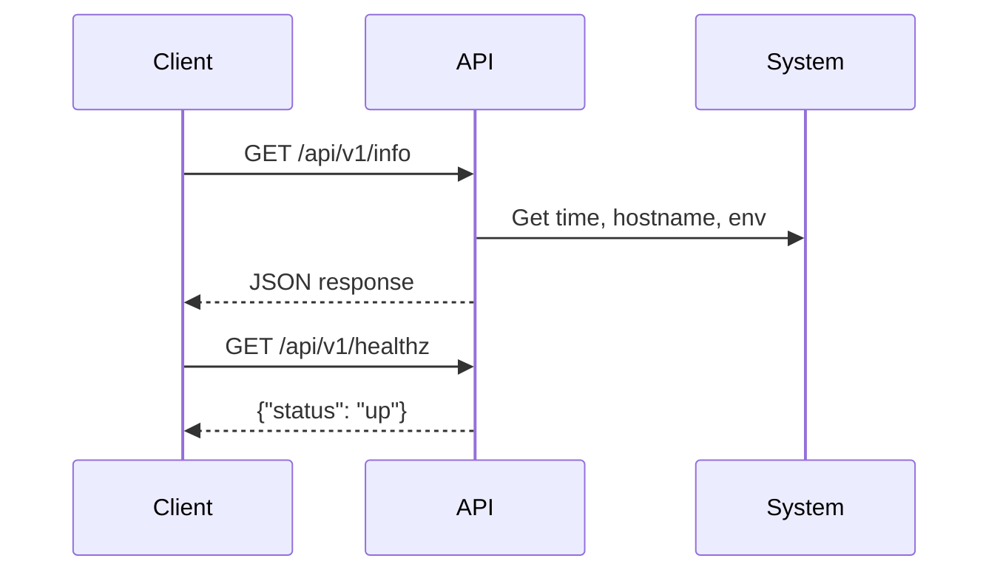

# Architecture

This application is a lightweight REST API built with Flask.

## Endpoints

- `/api/v1/info`: Returns a JSON object with a greeting, current server time, hostname, and an environment variable.
- `/api/v1/healthz`: Returns a simple health check status.

## Service endpoint

To get the url exposed by the load balancer, run:
```bash
echo "http://$(kubectl get svc -n python-api-app-3-dev -o jsonpath={.items[].status.loadBalancer.ingress[0].hostname}):5000/api/v1/info"
```

## Images

[Dockerhub/johnyunez/python-api-app-3](https://hub.docker.com/repository/docker/johnyunez/python-api-app-3)

## Components

- **Flask**: Web framework for Python.
- **Docker** (optional): For containerized deployment.
- **Environment Variables**: Reads `INFRA_DATA` and sets `APP_ENV` for configuration.

## Sequence Diagram

